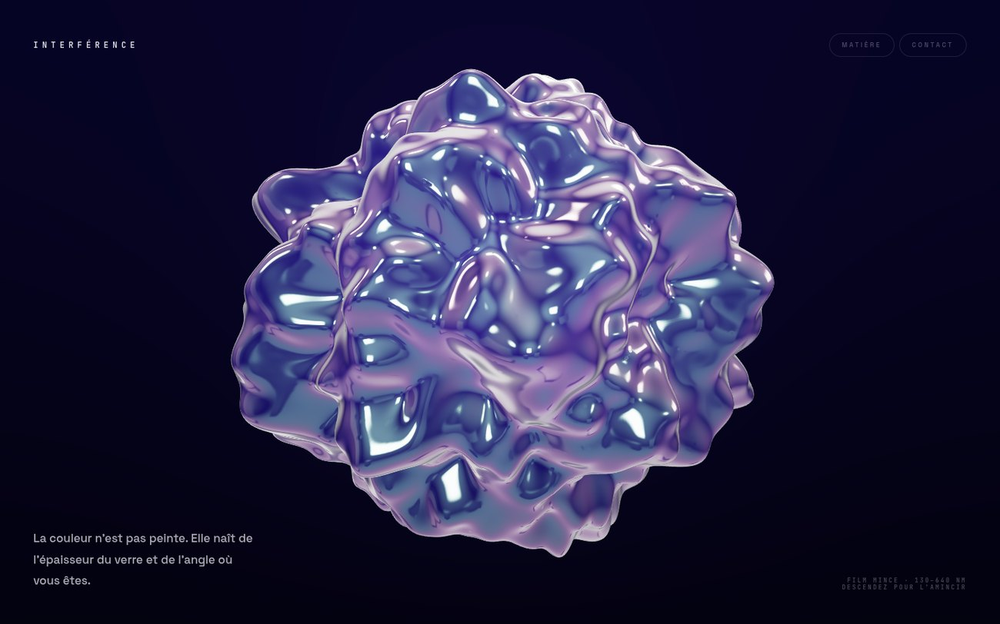

# 🫧 Interférence

### Une matière de verre iridescent, calculée en temps réel — pièce WebGL, **rendue image par image dans le navigateur.**

 

## Le principe

La couleur n'est pas peinte. C'est un **film mince** — une fine couche de verre dont l'épaisseur
varie de 130 à 640 nanomètres — et sa teinte **naît de l'angle** où se trouve l'œil, comme une
bulle de savon ou une nappe d'essence. Rien n'est une texture : tout est du calcul optique, à chaque image.

- **Verre physique** — `MeshPhysicalMaterial` : transmission, réfraction (IOR 1.47), iridescence, clearcoat.
- **Forme vivante** — une icosphère déformée par du **bruit simplex** dans le vertex shader ; la normale
  est recalculée après déformation, sinon la lumière ment.
- **Le scroll ne défile pas — il transforme la matière** : l'amplitude du bruit monte, le film s'amincit,
  le verre passe de calme à tourmenté.
- **La souris fait tourner** le volume. La couleur suit le regard.
- **Les reflets sont procéduraux** (`RoomEnvironment` + PMREM) — **aucune image d'environnement chargée.**

## Sous le capot

- **three.js `r185`, vendorisé** (`assets/vendor/`) — self-hébergé, **zéro CDN**, tout passe la CSP `'self'`.
- **Un shader GLSL fait main** (bruit simplex 3D, domaine public) greffé via `onBeforeCompile`.
- **CSP stricte** + `prefers-reduced-motion` (le mouvement se coupe, la matière reste).
- `IcosahedronGeometry(1.25, 128)`, DPR clampé à 1.75, tone mapping ACES.
- **0 dépendance runtime hors three.js**, 0 build, 0 framework.

> Démo — projet vitrine. Le code est libre (ISC). three.js est sous licence MIT (voir `assets/vendor/`).
